# 🪙 Cost-Benefit-Analysis-in-Steel-Manufacturing-using-Excel-VBA
This repository contains an advanced Excel-VBA driven financial analysis tool to evaluate **annealing line investment** improving **narrow-width coil processing** in a steel manufacturing facility

---

## 💰 Cost Benefit Analysis
Every solution should be evaluated on the cost to implement it and the benefits realized from it

### Net Present Value (NPV)
NPV takes the initial costs and expected net benefits of each solution and converts them into present day dollars
-             Profitability = NPV (Net Benefits) - Initial Cost

### Internal Rate of Return (IRR)
It is the discounted rate wehre NPV = 0. If the value is less than cost of capital, solution is not implemented due to benefit constraints

### Solution Screening
- It is a theoritical approach
- It is evaluated using Cost and Benefit Analysis
- The test is prioritized from brainstorming exercises
- It is screened with potential success with **Piloting**
- 
### Piloting
Piloting is a technique for deploying solution or change in small teams or groups. It is used to deploy solution to:
- 10% of entire scope
- 40% of entire scope
- Remaining 50% of the entire scope

### Pilot Validation
At each phase in the pilot:-

The paired t-test should check

```mermaid
flowchart TD;
A[Has x̄ changed significantly] --> |Yes| B[Has output variable performance changed] --> |Yes| C[Commence next piloting phase] --> |A month after full implementation| D[Is the change effective? Revalidate with a paired t-test];
```

---

## 💷 Case study: Investment evaluation in Automated Annealing line
### Business scenario
A steel manufacturer wants to improve profitability during the current quarter by investing in a semi-automated annealing line. The proposal includes:
- Initial investment: INR 60,00,000
- Expected savings (Quarterly) : INR 8,00,000 over 3 years (12 quarters)
- Residual value: INR 5,00,000 after 3 years
- Discount rate: 12%

### Objective
Assess the investment using
- Cost-Benefit ratio
- NPV
- IRR
- Run a solution screening matrix
- Simulate pilot outcomes

### Solution Screening Matrix
In a Steel Manufacturing setup, 
**Step 1**: List all evaluation criteria**
- Durability Impact
- Cost Efficiency
- Implementation Time
- Payback speed
- Environmental Compliance

**Step 2**: Use a 100-point allocation method (Most common)
1. Assign 100 total points across all criteria based on their importance
2. More important criteria get more points
3. Normalize them to add up to 1 or 100%

|*Criteria*|*Raw Score*|*Weight(normalized)*|
|----------|-----------|--------------------|
|Durability impact|30|0.3|
|Cost Efficiency|20|0.2|
|Implementation Time|15|0.15|
|Payback speed|25|0.25|
|Environmental Impact|10|0.1|
|**Total**|**100**|**1.00**|

**Step 3**: Validate through stakeholders
1. Ask team members to suggest scores
2. Take average or consensus to finalize the weights

### VBA Code for analysis
-           Sub Steel_Profitability_Analysis_With_Screening_And_Pilot()

            Dim ws As Worksheet
            Dim weights() As Double
            Dim j As Integer
    
            ' Sheet setup
            On Error Resume Next
            Application.DisplayAlerts = False
            Worksheets("Steel_Analysis").Delete
            Application.DisplayAlerts = True
            On Error GoTo 0
            Set ws = ThisWorkbook.Sheets.Add
            ws.Name = "Steel_Analysis"
    
            Dim cashFlows(1 To 13) As Double ' 12 quarters + residual
            Dim i As Integer
    
            ' Inputs
            Dim initialInvestment As Double: initialInvestment = 6000000
            Dim quarterlySavings As Double: quarterlySavings = 800000
            Dim residualValue As Double: residualValue = 500000
            Dim discountRate As Double: discountRate = 0.12 / 4 'quarterly
    
            ' Populate cash flows
            For i = 1 To 12
                cashFlows(i) = quarterlySavings
            Next i
                cashFlows(13) = residualValue
    
            ' Write to sheet
            ws.Range("A1").Value = "Quarter"
            ws.Range("B1").Value = "Cash Flow"
            For i = 1 To 13
                ws.Cells(i + 1, 1).Value = "Q" & i
                ws.Cells(i + 1, 2).Value = cashFlows(i)
            Next i
            ws.Range("A15").Value = "Initial Investment"
            ws.Range("B15").Value = -initialInvestment
    
            ' Calculate NPV
            Dim npv As Double
                npv = -initialInvestment
            For i = 1 To 13
                npv = npv + cashFlows(i) / ((1 + discountRate) ^ i)
            Next i
    
            ' Write NPV
            ws.Range("A16").Value = "Net Present Value (NPV)"
            ws.Range("B16").Value = npv
    
            ' Calculate IRR using built-in function
            Dim cashArray() As Double
            ReDim cashArray(0 To 13)
                  cashArray(0) = -initialInvestment
            For i = 1 To 13
                  cashArray(i) = cashFlows(i)
            Next i
    
            Dim irrVal As Double
            On Error Resume Next
            irrVal = WorksheetFunction.IRR(cashArray)
            On Error GoTo 0
    
            ws.Range("A17").Value = "Internal Rate of Return (IRR)"
            ws.Range("B17").Value = Format(irrVal * 100, "0.00") & "%"
    
            ' Cost-Benefit ratio
            Dim totalBenefit As Double: totalBenefit = Application.WorksheetFunction.Sum(cashArray)
            Dim cbr As Double: cbr = totalBenefit / initialInvestment
    
                ws.Range("A18").Value = "Cost-Benefit Ratio"
                ws.Range("B18").Value = Format(cbr, "0.00")
    
            ' Piloting ROI
            ws.Range("D1").Value = "Pilot Simulation"
            ws.Range("D2").Value = "Q1 ROI"
            ws.Range("D3").Value = Format(cashFlows(1) / initialInvestment, "0.00%")
            ws.Range("D4").Value = "Q1+Q2 ROI"
            ws.Range("D5").Value = Format((cashFlows(1) + cashFlows(2)) / initialInvestment, "0.00%")
            ws.Range("D6").Value = "Q1+Q2+Q3 ROI"
            ws.Range("D7").Value = Format((cashFlows(1) + cashFlows(2) + cashFlows(3)) / initialInvestment, "0.00%")
    
            ' Solution Screening Matrix
            Dim criteria As Variant, options As Variant, rawScores As Variant
            criteria = Array("Durability", "Cost Efficiency", "Implementation Time", "Payback Speed")
            options = Array("Option A", "Option B", "Option C")
            rawScores = Array(30, 20, 20, 30) ' User-definred raw weights
    
            ReDim weights(1 To UBound(rawScores) + 1)
            Dim totalWeight As Double
                  For i = 0 To UBound(rawScores)
                    totalWeight = totalWeight + rawScores(i)
                  Next i
    
                  For i = 0 To UBound(rawScores)
                    weights(i + 1) = rawScores(i) / totalWeight
                  Next i
    
            ' Write screening table header
              ws.Range("F1").Value = "Criteria"
              ws.Range("G1").Value = "Weight"
                For j = 0 To UBound(options)
                    ws.Cells(1, 8 + j).Value = options(j)
                Next j
    
            ' Criteria weights and scores
              Dim scores(1 To 4, 1 To 3)
              scores(1, 1) = 3: scores(1, 2) = 4: scores(1, 3) = 2
              scores(2, 1) = 2: scores(2, 2) = 4: scores(2, 3) = 3
              scores(3, 1) = 4: scores(3, 2) = 3: scores(3, 3) = 5
              scores(4, 1) = 3: scores(4, 2) = 4: scores(4, 3) = 2
              
              For i = 1 To 4
                  ws.Cells(i + 1, 6).Value = criteria(i - 1)
                  ws.Cells(i + 1, 7).Value = weights(i)
                  For j = 1 To 3
                      ws.Cells(i + 1, 7 + j).Value = scores(i, j)
                  Next j
              Next i
              
              ' Weighted Total
              ws.Cells(6, 6).Value = "Total Score"
              For j = 1 To 3
                  Dim totalScore As Double
                  totalScore = 0
                  For i = 1 To 4
                      totalScore = totalScore + (scores(i, j) * weights(i))
                  Next i
                  ws.Cells(6, 7 + j).Value = Format(totalScore, "0.00")
              Next j
              
              MsgBox "All financials, screening, and pilot evaluation completed!"
              
          End Sub

---

## 💴 Excel Functionalities used
- Visual Basic Editor
- NPV()
- IRR()
- SUM()
- SUMPRODUCT()

---

## 💳 Requirements
- Microsoft Excel 2016 or later
- Fundamentals of Financial analysis

---

*"WIth everything in business, the benefits gained should exceed the cost incurred"*
