# 🪙 Cost-Benefit-Analysis-in-Steel-Manufacturing-using-Excel-VBA
This repository contains an advanced Excel-VBA driven financial analysis tool to evaluate **annealing line investment** improving **narrow-width coil processing** in a steel manufacturing facility

---

## 💰 Cost Benefit Analysis
Every solution should be evaluated on the cost to implement it and the benefits realized from it

### Net Present Value (NPV)
NPV takes the initial costs and expected net benefits of each solution and converts them into present day dollars
-             Profitability = NPV (Net Benefits) - Initial Cost

### Internal Rate of Return (IRR)
It is the discounted rate wehre NPV = 0. If the value is less than cost of capital, solution is not implemented due to benefit constraints

### Solution Screening
- It is a theoritical approach
- It is evaluated using Cost and Benefit Analysis
- The test is prioritized from brainstorming exercises
- It is screened with potential success with **Piloting**
- 
### Piloting
Piloting is a technique for deploying solution or change in small teams or groups. It is used to deploy solution to:
- 10% of entire scope
- 40% of entire scope
- Remaining 50% of the entire scope

### Pilot Validation
At each phase in the pilot:-

The paired t-test should check

```mermaid
flowchart TD;
A[Has x̄ changed significantly] --> |Yes| B[Has output variable performance changed] --> |Yes| C[Commence next piloting phase] --> |A month after full implementation| D[Is the change effective? Revalidate with a paired t-test];
```

---

## 💷 Case study: Investment evaluation in Automated Annealing line
### Business scenario
A steel manufacturer wants to improve profitability during the current quarter by investing in a semi-automated annealing line. The proposal includes:
- Initial investment: INR 60,00,000
- Expected savings (Quarterly) : INR 8,00,000 over 3 years (12 quarters)
- Residual value: INR 5,00,000 after 3 years
- Discount rate: 12%

### Objective
Assess the investment using
- Cost-Benefit ratio
- NPV
- IRR
- Run a solution screening matrix
- Simulate pilot outcomes

### Solution Screening Matrix
In a Steel Manufacturing setup, 
**Step 1**: List all evaluation criteria**
- Durability Impact
- Cost Efficiency
- Implementation Time
- Payback speed
- Environmental Compliance

**Step 2**: Use a 100-point allocation method (Most common)
1. Assign 100 total points across all criteria based on their importance
2. More important criteria get more points
3. Normalize them to add up to 1 or 100%

|*Criteria*|*Raw Score*|*Weight(normalized)*|
|----------|-----------|--------------------|
|Durability impact|30|0.3|
|Cost Efficiency|20|0.2|
|Implementation Time|15|0.15|
|Payback speed|25|0.25|
|Environmental Impact|10|0.1|
|**Total**|**100**|**1.00**|

**Step 3**: Validate through stakeholders
1. Ask team members to suggest scores
2. Take average or consensus to finalize the weights

###
